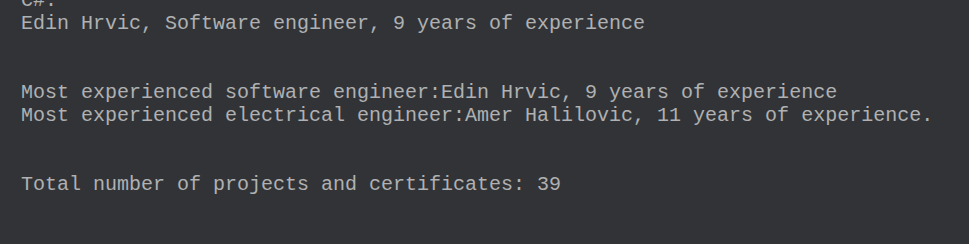
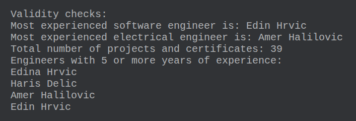

[](https://classroom.github.com/a/W8Cz89hX)
# RMAS-2025-hw1
Zadaca br. 1 za predmet Razvoj mobilnih aplikacija i servisa 2025/26

# 🎓 Zadaća 1 — B  
**Predmet:** Razvoj mobilnih aplikacija i servisa  
**Semestar:** 2025/2026  
**Okruženje:** [Kotlin Playground](https://play.kotlinlang.org/)


## Uvod
U nastavku se nalazi rjesenje zadace broj 1, zadatak B. U prvom dijelu zadatka implementirane su neke jednostavne klase, interfejsi. Prikazana je i primjena nasljedjivanja. Cilj drugog dijela zadatka je bilo razumijevanje i upotreba agregatnih funkcija kao sto su reduce, fold, map, filter i slicno. Navedene funkcije su koristene sa razlicitim vrstama kolekcija. U nastavku se nalazi detaljan pregled koda.


## Interface Person
```kotlin
interface Person {
    fun getName()
    fun getTitle()
}
```
Kao sto je navedeno u tekstu zadatka napravljen je interfejs koji sadrzi dva metoda, getName() i getTitle(). Buduci da je Person interface, njegovi metodi su apstraktni.


## Klasa Engineer
```kotlin
open class Engineer(
    val name: String,
    val surname: String,
    val dateOfBirth: String,
    val title: String,
    val experience: Int,
    val expertiseFields: String
) : Person {

    init {
        require(name.isNotBlank()) { "Name must be valid." }
        require(surname.isNotBlank()) { "Surname can't be empty." }
        require(title.isNotBlank()) { "Engineer must have a valid title." }
        require(experience >= 0) { "Experience must be zero or positive." }
        require(expertiseFields.isNotBlank()) { "Engineer must have at least one expertise field." }
    }

    override fun getName() {
        println("Engineer’s name: $name $surname")
    }

    override fun getTitle() {
        println("Engineer’s title: $title")
    }

    open fun printInfo() {
        println("$name $surname – $title – $experience godina – Ekspertize: $expertiseFields")
    }
}
```
Klasa Engineer implementiran interface Person. To znaci da sadrzi implementacije za dva metoda iz interface-a Person, to su getName() i getTitle(). Definiran je i primarni konstruktor sa poljima klase. Polja klase su name, surname, dateOfBirth, title, experience i expertiseFields sa pripadajucim tipovima podataka. init predstavlja nastavak tijela primarnog konstruktora i u njemu se provjerava validnost vrijednosti svih polja klase. Klasa Engineer ima i jednan metod oznacen sa open, to znaci da ce ga subklase moci override-ati. To je metod printInfo koji sluzi za printanje osnovnih informacija o inzenjeru.

## Klasa SoftwareEngineer 
```kotlin
class SoftwareEngineer(
    name: String,
    surname: String,
    dateOfBirth: String,
    experience: Int,
    expertiseFields: String,
    val numOfProjects: Int,
    val programmingLanguage: String
) : Engineer(name, surname, dateOfBirth, "Software engineer", experience, expertiseFields) {

    init {
        require(numOfProjects >= 0) { "Number of projects can't be negative." }
    }

    override fun printInfo() {
        println("$name $surname – $title – $experience years of experience – projects: $numOfProjects – expertises: $expertiseFields")
    }
    
    fun knowledgeLevel(){
        when(numOfProjects){
            0 -> println("Low level software engineer.")
            in 1..7 -> println("Medium level software engineer.")
            in 10..1000 -> println("High level software engineer.")
        }
    }
    
    fun favoriteLanguage(){
        println("${name}'s favorite language is ${programmingLanguage}.")
    }
}
    
}
```
Klasa SoftwareEngineer nasljedjuje od klase Engineer, sto znaci da nasljedjuje i njena polja i metode. U konstruktoru klase SoftwareEngineer nisu koristene kljucne rijeci val ili var za prvih nekoliko parametara. Razlog je sto su zapravo ova polja vec definirana u super klasi, te nema potrebe za ponavljanjem. Dodatna polja koja ima samo klasa SoftwareEngineer oznacena su sa val ili var, kao npr numOfProjects. Nakon definicje primarnog konstruktora slijedi poziv konstruktora super klase sa odgovarajucim argumentima. init blok ima istu ulogu kao i u klasi Engineer. Funkcja printInfo je override-ovana iz super klase, prilagodjena softverskim inzenjerima. Metodi knowledgeLevel() i favoriteLanguage() su dodatne funkcije karakteristicne za softverskog inzenjera.

## Klasa ElectricalEngineer
```kotlin
class ElectricalEngineer(
    name: String,
    surname: String,
    dateOfBirth: String,
    experience: Int,
    expertiseFields: String,
    val numberOfCertificates: Int
) : Engineer(name, surname, dateOfBirth, "Electrical engineer", experience, expertiseFields) {

    init {
        require(numberOfCertificates >= 0) { "Number of certificates must be zero or positive." }
    }

    override fun printInfo() {
        println("$name $surname – $title – $experience years of experience – Certifikati: $numberOfCertificates – expertises: $expertiseFields")
    }
    
    fun knowledgeLevel(){
        when(numberOfCertificates){
            0 -> println("Low level electrical engineer.")
            in 1..7 -> println("Medium level electrical engineer.")
            in 10..1000 -> println("High level electrical engineer.")
        }
    }
     
}

```
Klasa ElectricalEngineer slicno klasi SoftwareEngineer ima svoja vlastita nova polja oznacena sa val ili var, te samo parametre za polja Engineer klase. Poziva se konstruktor super klase.init blok ima istu ulogu kao i u klasi Engineer. Funkcija printInfo je override-ovana iz super klase, prilagodjena inzenjerima elektrotehnike.

## fold()
```kotlin
fun groupEngineersByExpertise(engineers: List<Engineer>): Map<String, List<Engineer>> {
    return engineers
        .filter { it.experience > 5 } 
        .fold(mutableMapOf<String, MutableList<Engineer>>()) { acc, engineer ->
            val fields = engineer.expertiseFields.split(",").map { it.trim() }
            for (field in fields) {
                acc.getOrPut(field) { mutableListOf() }.add(engineer)
            }
            acc
        }
}
```
U funkciji iznad se primjenjuju agregatne funkcije filter, map i fold. Funkcija uzima kao argument listu inzenjera, a vraca mapu inzenjera grupisanih po poljima ekspertize. Agregatna funkcija filter vraca samo one elemente liste cije iskustvo je vece od 5. Na ovaj nacin se izbjegava rad sa nepotrebnim elementima. Potom, agregatna funkcija fold kao prvi parametar uzima akumulaciju koja je na pocetku prazna mapa. Mapa mora biti mutable da bi se mogli dodavati novi elementi u svakoj iteraciji. Mapa ima kljuceve tipa String koji su namijenjeni za polja ekspertize, a vrijednosti mape su tipa List<Engineer> da bi se mogli spremiti inzenjeri u odogvarajuce grupe. Fold kao drugi parametar uzima lambda izraz na osnovu kojeg vrsi rekurzivni proracun. Lambda izraz radi na nacin da se prolazi kroz listu inzenjera, prvi svakom prolazu se spreme ekspertize tog inzenjera. Potom za svaku ekspertizu se kreira kljuc, ako kljuc vec postoji inzenjer se samo dodaje u listu koja odgovara vec postojecem kljucu. Lambda izraz mora vratiti akumulaciju, u zadnji red se stavlja varijabla acc.

## reduce()
```kotlin
fun findMostExperiencedEngineers(engineers: List<Engineer>): Pair<SoftwareEngineer?, ElectricalEngineer?> {
    val softwareEngineers = engineers.filterIsInstance<SoftwareEngineer>()
    val electricalEngineers = engineers.filterIsInstance<ElectricalEngineer>()

    val mostExperiencedSoftware = softwareEngineers.reduce {acc, current ->
        if (current.experience > acc.experience) current else acc
    }

    val mostExperiencedElectrical = electricalEngineers.reduce { acc, current ->
        if (current.experience > acc.experience) current else acc
    }

    return Pair(mostExperiencedSoftware, mostExperiencedElectrical)
}
```
Cilj funkcije je pronaci inzenjere sa najvecim brojem godina iskustva. Na pocetku funckije lista inzenjera se rastavlja na dvije i to tipa SoftwareEngineer i ElectricalEngineer. U ove svrhe upotrebljena je funkcija filterIsInstance(). Da se pronadje najiskusniji inzenjer iz billo koje od navedenih listi potrebno je koristiti agregatnu funkciju reduce. Agregatna funckija reduce prolazi kroz sve elemente liste i ne treba pocetnu vrijednost za akumulaciju. Koristi se za poredjenje elemenata liste, sto je i potrebno u ovom slucaju. reduce() prolazi kroz cijelu listu inzenjera i poredi njihove godine iskustva, onaj objekat koji ima veci broj godina iskustva biva vracen rekurzivno u narednu iteraciju. Funkcija vraca poseban objekat tipa Pair jer je potrebno vratiti najiskusnijeg inzenjera za svaku od listi.

## agregate()
```kotlin
fun calculateTotalProjectsAndCertificates(engineers: List<Engineer>): Int {
    val softwareEngineers = engineers.filterIsInstance<SoftwareEngineer>()
    val electricalEngineers = engineers.filterIsInstance<ElectricalEngineer>()

    val totalProjects = softwareEngineers.aggregate(0) {acc, engineer -> acc + engineer.numOfProjects }
    val totalCertificates = electricalEngineers.aggregate(0) {acc, engineer -> acc + engineer.numberOfCertificates}

    val total = totalProjects + totalCertificates
    println("Total number of projects and certificates: $total")
    return total
}

fun <T> Iterable<T>.aggregate(initial: Int, operation: (acc: Int, T) -> Int): Int {
    var acc = initial
    for (element in this) acc = operation(acc, element)
    return acc
}
```
aggregate() nije ugradjena agregatna funkcija kao sto su to reduce() ili filter(). Dakle potrebno je prvo definirati aggregate(), pa je potom upotrijebiti. aggregate() mora imati potpis slican drugim agregatnim funkcijama (filter, map). Mora implementirati interface Itreable, a kao parametre ima inicijalnu vrijednost za akumulaciju i lambda izraz koji predstavlja operaciju koju ce aggregate izvrsavati. U funkcijji calculateTotalProjectsAndCertificates se uzima kao argument lista inzenjera. Lista se rastavlja na dvije kako je vec ranije objasnjeno. Potom se za svaku od listi inzenjera poziva agreggate. Kao inicijalna vrijednost se prosljedjuje 0, a kao operacija lambda izraz koji sabira rekurzivno broj projekata/certifikata svakog od inzenjera u datoj listi. Na kraju, funkcija vraca ukupan broj projekata i certifikata.

## main()
```kotlin
fun main() {
    val engineers = listOf(
        SoftwareEngineer("Edina", "Hrvic", "2003-07-25", 8, "Kotlin, C++, Java", 15, "C++"),
        SoftwareEngineer("Elina", "Hrvic", "1997-10-10", 3, "Java, Databases, C#", 4, "Java"),
        ElectricalEngineer("Haris", "Delic", "1988-03-21", 8, "Power systems, PCB design", 6),
        ElectricalEngineer("Amer", "Halilovic", "1985-06-11", 11, "Embedded systems, PCB design", 10),
        SoftwareEngineer("Edin", "Hrvic", "1997-10-10", 9, "C++, React, C#", 4, "React")

    )
```
U main-u je kreirana lista inzenjera.
```kotlin
val groups = groupEngineersByExpertise(engineers)
    for (group in groups){
        println(group.key + ": ")
        for(engineer in group.value){
            println(engineer.name + " " +  engineer.surname +", " + engineer.title + ", " + engineer.experience + " years of experience")
        }
    }
```
Potom je pozvana funkcija groupingEngineersByExpertise koja grupise inzenjere. Nakon toga su ispisane grupe inzenjera na osnovu ekspertiza. Ispis je implementiran pomocu dvije petlje koje prolaze kroz elemente mape koristeci polja key i value.
```kotlin
	println()
	println()
    	val (softwareeng, electricaleng) = findMostExperiencedEngineers(engineers)
    	println("Most experienced software engineer:" + softwareeng?.name + " " + 			softwareeng?.surname + ", "  + softwareeng?.experience + " years of experience")
    println("Most experienced electrical engineer:" + electricaleng?.name + " " + electricaleng?.surname + ", "  + electricaleng?.experience + " years of experience.")
```
U nastavku je pozvana funkcija findMostExperiencedEngineers i ispisani su njeni rezultati.
```kotlin
    println()
    println()
    val numberOfCertificatesAndProjects = calculateTotalProjectsAndCertificates(engineers)
```
Pozvana je i funkcija calculateTotalProjectsAndCertificates.
```kotlin
 println("Validity checks:")

    
	val softwareEngineers = engineers.filterIsInstance<SoftwareEngineer>()
	val electricalEngineers = engineers.filterIsInstance<ElectricalEngineer>()
	
	var maxExp = 0
	var softwareEng: SoftwareEngineer? = null
	for (element in softwareEngineers) {
    	if (element.experience > maxExp) {
        	maxExp = element.experience
        	softwareEng = element
    	}
	}

	maxExp = 0
	var electricalEng: ElectricalEngineer? = null
	for (element in electricalEngineers) {
    	if (element.experience > maxExp) {
        	maxExp = element.experience
        	electricalEng = element
    	}
	}

	println("Most experienced software engineer is: ${softwareEng?.name} ${softwareEng?.surname}")
	println("Most experienced electrical engineer is: ${electricalEng?.name} ${electricalEng?.surname}")
```
Provjera ispravnosti rezultata koje je vratila funkcija za pronalazak inzenjera sa najvecim brojem godina iskustva.
```kotlin
    var numOfProjects = 0
    for(element in softwareEngineers){
        numOfProjects += element.numOfProjects
    }
    var numOfCertificates = 0
    for(element in electricalEngineers){
        numOfCertificates  += element.numberOfCertificates
    }

    println("Total number of projects and certificates: " + (numOfProjects + numOfCertificates))
```
Provjera ispravnosti broja projekata i certifikata koji je izracunala funkcija calculateTotalProjectsAndCertificates.
```kotlin
   println("Engineers with 5 or more years of experience: ")
   for(element in engineers){
       if(element.experience > 5){
       	println("${element?.name} ${element?.surname}")
       }
   }
```
 I na kraju provjera agregatne funkcije filter koja je koristena na pocteku grupisanja inzenjera.
}
## reduce(), fold(), agregate()
fold() agregatna funkcija kao parametre ima pocetnu akumulaciju i labmda izraz. Fold rekurzivno prolazi kroz sve elemente liste, te se akumulacija prenosi iz iteracije u iteraciju. Koristi se kada zelimo izvrsiti neku operaciju nad listom, ali uz datu pocetnu vrijednost. Povratna vrijednost je akumulirana vrijednost. reduce() kao parametar ima samo lambda izraz koji se primjenjuje na sve elemente liste. Povratna vrijednost bude obicno jedan elemenat liste. Koristi se kada nije potrebna nikakva dodatna vrijednost osim elemenata liste. aggregate() kao parametre uzima inicijalnu vrijednost za akumulaciju i lambda izraz koji vrsi neku operaciju. Operacije su obicno matematicke agregatne operacije.

## Upotreba AI alata
AI alat je koristen za funkciju aggregate() jer nije ugradjena funkcija poput reduce(), te mi je bila potrebna pomoc oko potpisa funkcije.
## Primjeri izvrsavanja programa
<p align="center">
  
</p>
<p align="center">
  
</p>
<p align="center">
  
</p>
